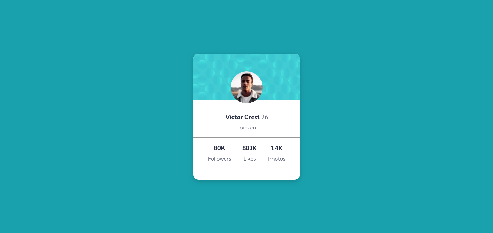

# Frontend Mentor - Profile card component solution

This is a solution to the [Profile card component challenge on Frontend Mentor](https://www.frontendmentor.io/challenges/profile-card-component-cfArpWshJ). Frontend Mentor challenges help you improve your coding skills by building realistic projects. 

## Table of contents

- [Overview](#overview)
  - [The challenge](#the-challenge)
  - [Screenshot](#screenshot)
  - [Links](#links)
- [My process](#my-process)
  - [Built with](#built-with)
  - [Continued development](#continued-development)
  - [Useful resources](#useful-resources)
- [Author](#author)

## Overview

### The challenge

- Build out the project to the designs provided

### Screenshot

### Links

- Solution URL: [Souce Code](https://github.com/Sazid99246/profile-card-component)
- Live Site URL: [Live Site](https://sazid99246.github.io/profile-card-component/)

## My process

### Built with

- Semantic HTML5 markup
- Flexbox

### Continued development

However, I couldn't add the corner backgrounds that are shown in the design. I am currently searching for how to do that. If you know, please give me a hand.

### Useful resources

- [CSS background image size 50%](https://stackoverflow.com/questions/19747634/css-background-image-size-50) - This helped me to find the background-size property for the pattern-background.
- [background-size on MDN](https://developer.mozilla.org/en-US/docs/Web/CSS/background-size) - This is the actual place where I learned how to use the background-size property.

## Author

- Website - [Sheikh Md. Sazidul Islam](https://my-portfolio-d6429.web.app/)
- Frontend Mentor - [@Sazid99246](https://www.frontendmentor.io/profile/Sazid99246)
